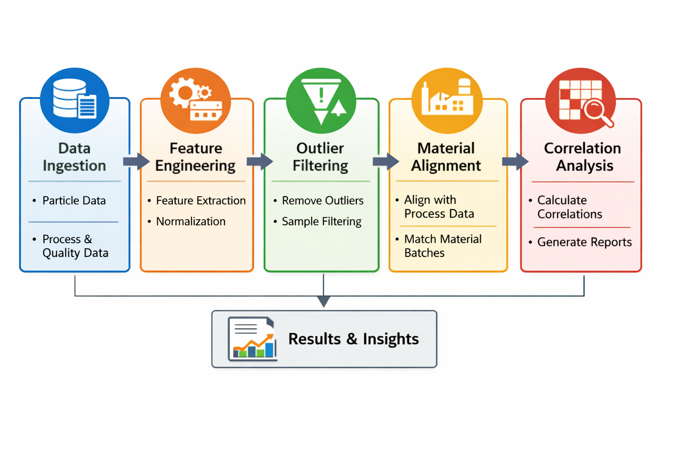

# Industrial Particle Feature Analysis



This repository provides a self‑contained example of how to process and analyse particle‑level sensor data in an industrial context.  The code is broken into logical modules that can be reused for other manufacturing datasets.

## Overview

Sensors in modern plants capture thousands of particle measurements per sample.  To extract anything useful from these numbers you have to:

1. **Aggregate per‑particle observations into sample‑level features.**  The `feature_engineering` module reads raw particle data and computes summary statistics (means, quantiles, etc.) and engineered metrics such as elongation.
2. **Filter out problematic samples.**  Low particle counts or extreme outliers bias downstream analysis; `outlier_filtering` implements simple rules to drop those cases.
3. **Align particle samples with process data.**  Production databases track material numbers and timestamps separately from particle measurements.  Functions in `material_alignment` match sample IDs to process conditions using timestamps.
4. **Compute correlations to quality metrics.**  The `correlation_analysis` module joins sample features to quality measurements (e.g. density, modulus of rupture, internal bond strength) and calculates correlation coefficients.  It supports both all‑rows and per‑material analyses.
5. **Visualise trends and distributions.**  The `visualization` module contains convenience functions for plotting distributions, time series and correlation heatmaps using matplotlib and Plotly.

The real industrial case involved merging data from proprietary particle sensors and cooling line logs, removing dust‑induced outliers and correlating engineered features against board quality measures.  Sensitive plant identifiers and raw datasets have been removed; instead, this repository ships with small synthetic CSV files and a redacted project summary in the `docs` folder.

## Quick start

1. Clone the repository and create a Python environment:

   ```bash
   git clone https://github.com/example/industrial-particle-feature-analysis.git
   cd industrial-particle-feature-analysis
   python -m venv .venv
   source .venv/bin/activate
   pip install -r requirements.txt
   ```

2. Inspect the example configuration in `configs/example_config.yaml`.  Adjust paths if you want to point at your own CSVs.  The config specifies where to find particle data, process data and quality data, and includes simple thresholds for outlier removal.

3. Run the pipeline on the sample data:

   ```bash
   python src/run_pipeline.py --config configs/example_config.yaml
   ```

This will generate a cleaned feature table, correlation results and a few plots into the `outputs` directory.  See the code in `src/` for details of each processing step.

## Repository structure

```
.
├─ README.md               – this file
├─ requirements.txt        – Python dependencies
├─ .gitignore              – ignore patterns for git
├─ configs/
│  └─ example_config.yaml  – sample configuration for the pipeline
├─ data/
│  ├─ sample/              – synthetic CSVs with the same schema as the real data
│  └─ README.md            – description of the data schema
├─ src/
│  ├─ feature_engineering.py  – functions for aggregating particle measurements
│  ├─ outlier_filtering.py   – sample count and z‑score based filters
│  ├─ material_alignment.py  – align samples with process/material records
│  ├─ correlation_analysis.py – compute correlations between features and quality targets
│  ├─ visualization.py       – helper functions for plotting
│  ├─ utils.py               – miscellaneous helpers
│  └─ run_pipeline.py        – entry point for the pipeline
├─ outputs/
│  └─ (generated files)    – will be created when you run the pipeline
├─ assets/
│  └─ (figures)            – static images used in the README and docs
└─ docs/
   └─ project_summary_redacted.pdf – high‑level description of the original industrial project
```

## Limitations

This example omits proprietary code and raw production data.  The sample CSVs are randomly generated and only illustrate the pipeline; they will not yield meaningful correlations.  If you plan to use this code on confidential data, ensure that you sanitise any plant identifiers and follow your company’s data handling policies.
